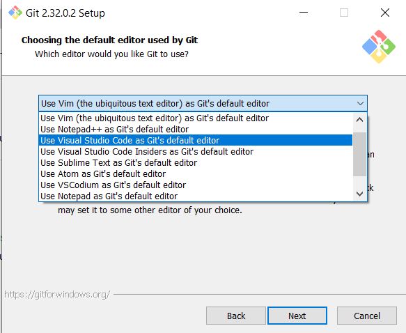
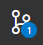

        

 

# Module 1: Git and GitHub
### Welcome to Python-2021! In this class, we will be using GitHub as our code repository. This is an industry standard that should be understood by all students looking to pursue a career path related to software.
 

# What is Git?
*"Git is a free and open source distributed version control system designed to handle everything from small to very large projects with speed and efficiency."*
 
&nbsp;&nbsp;&nbsp;&nbsp;&nbsp;&nbsp;&nbsp;&nbsp;&nbsp;&nbsp;&nbsp;&nbsp;&nbsp;&nbsp;&nbsp;&nbsp;&nbsp; \- [The Git Website](https://git-scm.com/)

#### Git allows you to track changes in a file system, referred to as a repository. Some examples would be adding and removing files, adding and removing lines in a file, renaming files.

 

## Repository
*"A receptacle or place where things are deposited, stored, or offered."*
 

&nbsp;&nbsp;&nbsp;&nbsp;&nbsp;&nbsp;&nbsp;&nbsp;&nbsp;&nbsp;&nbsp;&nbsp;&nbsp;&nbsp;&nbsp;&nbsp;&nbsp; \- My google search.
 

#### In class, we will refer to repositories as the copies of the course file-system that each one of us holds. Repositories are both local and remote, meaning that repositories are available both offline on your machine, and online on a remote webserver. In our class, we will use `GitHub` as our remote host.

 

## Pull
#### When you pull a repository, you are updating your local copy with any changes that have been made on the remote version.

 

## Commit
#### A commit saves any changes made to files on your local machine, to the local repository. Before committing, you will select which files and/or lines you would like to include. You don't have to include all of them, but you should make sure that what you are committing is correct. A commit requires a message. This message must be descriptive of what is being changed. This helps you keep track of every version change. Commits may be deleted or reverted locally before a Push.

 

## Push
#### Pushing to your remote repository will upload all pending commits. You should make sure that all commits are stable and correct before pushing. Once a commit has been pushed it will be available to anyone working on the repository. It is easier to delete or revert commits that are local and unpushed, as another user may pull bad code before you fix it. 
*You should always pull before pushing. This will make sure that what your are pushing is not outdated.*

 

# Install Git **Correctly** `(1pts)`
## Install [Git](https://git-scm.com/downloads) (Windows). 
### In this class, we'll use Visual Studio's integrated implementation of Git. 
### When installing, use default settings with these exceptions:
- Select Visual Studio Code as your default editor. 

- Use the default windows console. 

 

## Install [GitHub Desktop](https://desktop.github.com/) (Alternate). 
Any users that chose to use Visual Studio Code on Mac or have problems with VS Code's implementation of git may [Download GitHub Desktop](https://desktop.github.com/) as it is the easiest solution.

 

# What is GitHub?
Think of GitHub as an Instagram of Code. A whole bunch of programmers from all around the world share their code so that others may view, comment and like it. Some of the more proficient developers rack up followers who use their code. They all use the technology of Git and share it on this Hub. GitHub is free, but you may pay to keep your repositories private.

 

## Set up a GitHub Account.

### Go to [GitHub.com](https://github.com) and Sign Up **Correctly**. `(1pts)`
* Use your student Email.
* Use the following format for your <u>**username**</u>: CSI-Name-Lastname. 
* Pay attention to Capitalization.
* Use my github name as an example: `CSI-Carlos-Cobian`
 

 
*If it already exists, include your second last name.*

 

# What is a branch?     
Branches are different versions of a repository. A central branch(`main`) represents a repository, while many others represent modifications that are incomplete, in development, or just different. 

 

## Fork the class repository. `(1pts)`
Forking a repository will create a copy on your GitHub account. It is similar to a branch, but it exists in another repository. You own it now. You may freely alter this copy to take class notes and answer questions. These changes will only be reflected on your copy **(fork)** of the repository. 
 

### Visit the class repo and click on `fork`. (top right)
https://github.com/CSI-Carlos-Cobian/CSI-Python-2021

 

## Clone the repository into your machine `(1pts)`
### Create a folder on your machine **(Windows)**. 
You may name it whatever you please but I will use "Courses" as it is simple and descriptive.
This will be your root folder. This means it is the top-level containing folder. You may place it anywhere but I suggest using your Documents or Desktop folder. 
In here, you will clone the repositories for any courses that use GitHub. Currently Java, Python and hopefully NovaTech.
 

### Clone the project into the 'Classes' folder on your machine **(Windows)**.
1. Go to your `Source Control` tab in Visual Studio(3rd).

 

2. Initialize Repository (if you have not done so).
3. Click on the 3 dots (your git menu).
4. `Clone` the forked repository.
   - Select `Clone from GitHub`.
   - Alternatively, enter the fork URL with format: github.com/CSI-Name-Lastname/CSI-Python-2021.
5. When prompted by VS, select to open your new repo.

 

### Clone using GitHub Desktop. 
After signing in to GitHub, click on Clone and your fork should show up. **GitHub Desktop** automatically creates a folder on your Documents called <u>GitHub</u>. This is the equivalent of the *'Courses'* folder mentioned above. Within this folder you will find a folder named <u>CSI-Python-2021</u> containing your cloned course.

 

# Using Git
You may clone a repository without forking it, but only `contributors` may push changes to it. When you fork a copy, it becomes your own. 
 

*You may also update your copy **(fork)** of the repository to reflect any changes I have made to the course without overwriting your individual changes.*

 

## Update your fork:
You may update your fork on GitHub.com. When your fork is out of date, a banner will show up. Click on it to update your fork with any changes i've made. This is called pulling upstream. You're pulling changes from the primary remote repository, into **your** remote repository.
 

To download fork updates to your **local** repository(PC).
1. Go to your `Source Control` tab in Visual Studio(or GitHub Desktop).
2. Click on the 3 dots (your git menu).
3. Pull.

 

You may update both simultaneously from Visual Studio by selecting.
1. `Source Control` > Branch > Merge Branch
2. Select `upstream/main`

`upstream/main` represents the repository you've forked. 'Merging' it into you branch means that you're combining your modifications with the updates.

 

### [Source Tree Git](/../../tree/main/Modules/SourceTree/Setup.md) **(Optional)** 

* #### Provides easier visualization of branches and history. 
* #### Requires many 3rd party authorizations.

 

# Class Discussion
## Answer the questions on the Markdown file located within your <u>`Module1`</u> directory (Module1.md). `(4pts)`

<!-- This is a comment. It is not processed by the code -->
<!-- Welcome! These are your questions. -->
<!-- Answer using full sentences to receive all points. -->
<!-- 

What is the difference between Git and GitHub?

 - Answer:

What is the difference between a git commit and a git push?

 - Answer:

What is the difference between a pull, and an upstream pull?

 - Answer:

What part of these instructions was unclear or incomplete?

 - Answer:

Type down any class notes below this sentence:

Lackluster responses may result in point deductions.
-->

* ### Save the file. Commit your changes and push them to your remote repository by the next class. `(1pts)`*(Free for first class. Consult me during office hours if you struggle with Git.)*
* ### You may complete the answers by issuing additional commits and pushing them before the next class.

 

## [Next Module ->](/../../tree/main/Modules/Module2/Module2.md)
