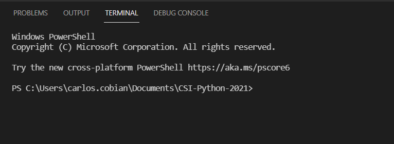

        

 

# Module 1: using Visual Studio Code

### Open visual studio code. Your first task is to change your working directory to that of the course.

1. Go to File > Open Folder
2. Select the directory you cloned your repository into `(CSI-Python-2021)`. 

 

### The first thing you will see on the left-most side of visual studio code is the file system for the class.

 

### On the bottom of your screen is the Terminal. Through here you may communicate directly with your computer's Operating System. 
 

# Communicate with Console

## Lets start by navigating through directories 
### Type the following commands into your console

`dir` will Show contents of current directory
 
`cd ..` will go back one directory

`cd CSI-Python-2021` will bring you back to the project directory (Assuming you went back one directory in the step before)

**(Hint)** After typing "`cd `" into the console you may hit the `TAB` key to run through the options available in the directory, or to autocomplete.

`cd Modules\Module1` will move you from
> C:\Users\user\Documents\CSI-Python-2021

to 

> C:\Users\user\Documents\CSI-Python-2021\Modules\Module1

 

# Interact with Python.

Python should have been installed and added to PATH. To verify this run: `python --version` and recieve an output of:
 
>Python 3.9.6

 

## Open Python Console

`python` will enter the Python console that should look like:

> Type "help", "copyright", "credits" or "license" for more information.
>
> \>\>\>

`print("Hello World!")` will run a simple python command that returns whichever string of text you have encapsulated into your doublequotes.

`exit()` will bring you back into your Operating System's console.

 

## Execute Python Script
Navigate to the Module1 directory and type: `python HelloWorld.py`. This will execute a python script.

The output should look like the following:

#### Take a screenshot of your output and save it in the <u>Module1</u> directory of your branch. Name the file using your name and the following naming convention: `CSI-Carlos-Cobian-Module1-1.png`

 

## Answer the following questions on the MarkDown file located within your `Module1` directory (Module1.md). 

 

what?

 - answer

who?

 - answer

where?

 - answer

 

#### Save the file.  Commit your changes by the end of the class. and Push this change and your image into your student branch.
### Doing and answering the questions below on time will grant you all points for today's lesson.

 
