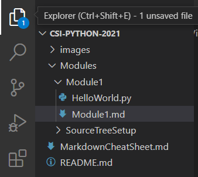

        

 

# Module 2: Using Visual Studio Code

### Create a commit merging master into your current branch. `(1pts)`

 

## What is [Markdown](https://www.markdownguide.org/getting-started/)?
Markdown is a lightweight markup language that you can use to add formatting elements to plaintext text documents.

 

### Open Visual Studio Code. Make sure that it is your working directory of the course.

1. Go to `File` > `Open Folder`
2. Select the directory you've cloned your repository into `(CSI-Python-2021)`. 

 

### The first thing you will see on the left-most side of visual studio code is the file system for the course.

 

### On the bottom of your screen is the Terminal. Through here you may communicate directly with your computer's Operating System. If you do not see it click on `Terminal` > `New Terminal` on your top menu.
 

# Communicate with Console

[*Some commands vary on the Mac Shell.*](https://www.makeuseof.com/tag/mac-terminal-commands-cheat-sheet/)

## Lets start by navigating through directories 
### Type the following commands into your console

* `dir` will Show contents of current directory
 
* `cd ..` will take you back one directory. It stands for change directory.

* `cd CSI-Python-2021` will bring you back to the project directory (Assuming you went back one directory in the step before)

***(Hint)** After typing "`cd`" into the console, you may hit the `TAB` key to run through the options available in the directory. It also works as an auto-complete shortcut.*

* `cd Modules\Module2` will move you from
> C:\Users\user\Documents\CSI-Python-2021

to 

> C:\Users\user\Documents\CSI-Python-2021\Modules\Module2

 

# Install [Python3](https://www.python.org/downloads/) Correctly`(1pts)`
### Run Python Installer
   - [X] Add Python to PATH

* *You may need to close and open Visual Studio after Installation.*

* *If prompted for Python Extensions, select to Install.*

* *Python for Visual Studio on Mac requires Developer Tools. Install them when prompted.*

 

# Interact with Python.

Python should have been installed and added to PATH. To verify this run: `python --version` and receive an output of:
 
>Python 3.9.6

 

## Open the Python Console

Typing `python` *(or `python3`)* into the terminal will enter the Python console:

> Type "help", "copyright", "credits" or "license" for more information.
>
> \>\>\>

`print("Hello World!")` will run a simple python command that returns whichever string of text you have encapsulated into your double quotes. In this case 
> Hello World!

`exit()` will bring you back into your Operating System's console.

 

## Execute Python Script
### Navigate to the Module2 directory and type: `python HelloWorld.py`. This will execute a python script.

### The output should look similar to this:

### Take a screenshot of your terminal's output showing the same elements as above. 
* #### On Windows use `WIN+SHFT+S` to make a selection.
* #### Save it in the <u>Module2</u> directory of your branch. 
* #### Name the file using the following convention: `CSI-Carlos-Cobian-Module2-1.png`

### Commit and push this image before the next lecture`(2pts)`

 

# Class Discussion
## Answer the questions on the Markdown file located within your `Module2` directory (Module2.md). `(4pts)`

<!-- Welcome! These are your questions. -->
<!-- Answer using full sentences to receive all points. -->
<!-- 

What is a benefit of using Markdown?
https://www.markdownguide.org/getting-started/

 - Answer:

What does "cd" stand for?

 - Answer:

Did you get stuck at any point or become confused with your console? (yes/no) If so, what happened? How did you solve it?

 - Answer:

Did you consider searching google for other commands to run? What did you try? 

 - Answer:

What would you like to program? 

 - Answer:

Type down any class notes below this sentence:

Lackluster responses may result in point deductions.
-->

* ### Save the file. Commit your changes and push them to your remote repository. `(1pts)`
* ### You may complete the answers by issuing **additional** commits and pushing them before the next class.

 

## [Next Module ->](/../../tree/main/Modules/Module3/Module3.md)