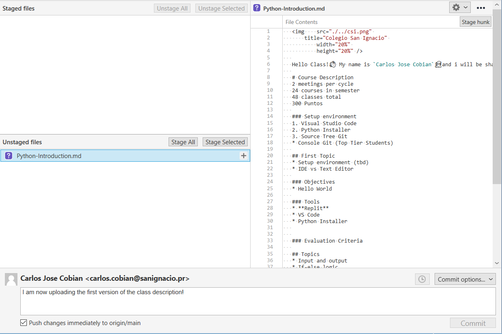

# What is Git?

### Git is a free and open source distributed version control system. GitHub is the largest Repository of open source code. By understanding how to use Git and GitHub you will have acces to most of the code that humanity has developed.
 

# Download Source Tree
### Go to [Source Tree](https://www.sourcetreeapp.com/) and download the Installer
There are Many git clients such as Console Git, GitHubDesktop, GitKraken. We will be using SourceTree as it is free and i consider it's branch management GUI to be very simple.

### Log in to your github account
1. Go to Tools > Options > Authentication
2. Click on Add
3. Select GitHub
4. Click on the Refresh OAuth button to Sign In.
5. Finish login using your browser

 

# Clone the Class Repository
### Visit the [Class Git Page](https://github.com/CSI-Carlos-Cobian/CSI-Python-2021) and click on the `Code`

### You will have the option to download the source as a Zip or clone it via URL. 
 

### In this class we will Clone it by copying the URL to our Source Control Client (SourceTree)
 

### if prompted for a credential manager i suggest *wincred* but this is not the default for MAC.

 

 

# Create a fork off the the Main branch.
### You will create a copy of the class folder on a branch using the same Username you selected for your GitHub Account. 

# **Commit** and **Push** 
### SourceTree will show you any changes you have made in the repository directory.

### At the end of every class you must create a **Commit** using SourceTree and **Push** it to GitHub. 

### Select the files and/or lines that you would like to commit and **stage** them. Select the *Push changes* checkbox and click on the commit button.