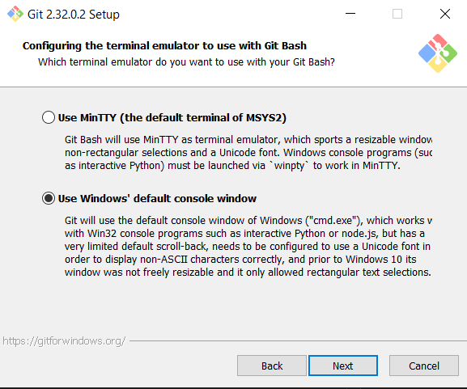

        

 

#### Hello Class!👋 My name is `Carlos Jose Cobian`🧙and i will be sharing with you some of my knowledge on computer programming by using the Python Language.

 

# Course Description
#### By understanding Git and GitHub you will acquire access to most of the code humanity has developed. Fundamental understanding of computer programming will allow you to visualize concepts beyond some standard limitations of your brain. 

2 meetings per cycle
24 courses in semester
48 classes total
At least 300 points.

## Objectives
* Understand Git version control and branching.
* Be able to understand the core aspects and syntax of a programming language.
* Be able to read and write algorithms using Python.  
* Be able to iterate through multidimensional arrays.
* Understand nesting.

## Tools

| Tool | Windows | Mac |
|----------|----------|----------|
| Editor (IDE) | [VS Code](https://code.visualstudio.com/download) | [XCode](https://developer.apple.com/xcode/)|
| Python | [Python3](https://www.python.org/downloads/) | [Python3](https://www.python.org/downloads/macos/) |
| Git | [Git](https://git-scm.com/downloads) | [Git](https://git-scm.com/download/win)   Included in XCode|
| Visual Repository  (optional) | [Sourcetree](https://www.sourcetreeapp.com/)| [Sourcetree](https://www.sourcetreeapp.com/) |

## Evaluation Criteria
* Student Pushes a comit into his branch at the end of every class. 
* Student commits answers to previous lectures' questionaires before the following class. 
   - Student uses full sentences on commit descriptions and questionaire answers. 
* Partial credit may be granted for late submisions.
* In class problem solving.
* Open branch final exam. 

## Topics
* Git and source control
* [Integrated Development Environment(IDE) and the Console](/../../tree/main/Modules/Module2/Module2.md)
* Input, output and functional strings.
* If-else logic **(Rock Paper Scisors)**
* Compound logic
* Looping (for, while) **(Fancy & Funky Print Loops)**
* Lists & Iteration **(Hangman Project)**
* 2D Arrays **(Snake)**
* Canvas, Vectors, Putting it all together. **(Egg Catcher)** 

## Suggested projects
* Egg Catcher
* Rock Paper Scisors
* Hangman
* Snake
* Conway's game of life
* Serial Interfacing with Arduino

 

# Setup Development Environment
1. Run Python Installer
   - [X] Add Python to PATH
2. Run Visual Studio Code Installer
3. Install Git
   - Use default settings with these exceptions.
   - Select Visual Studio Code as your default editor.
   - 
   - Use the default windows console.
   - 

 

# Setting up a GitHub Account. Follow Instructions!
### Go to [GitHub.com](https://github.com) and Sign Up.
* Use your student Email.
* Use the following format for your username: CSI-Name-Lastname. 
* Pay attention to Capitalization
* Use my github name as an example: `CSI-Carlos-Cobian`
 

 

# [Source Tree Git](/../../tree/main/Modules/SourceTree/Setup.md) **(Optional)** 

* ### Provides easier visualization of branching. 
* ### Requires many 3rd party authorizations